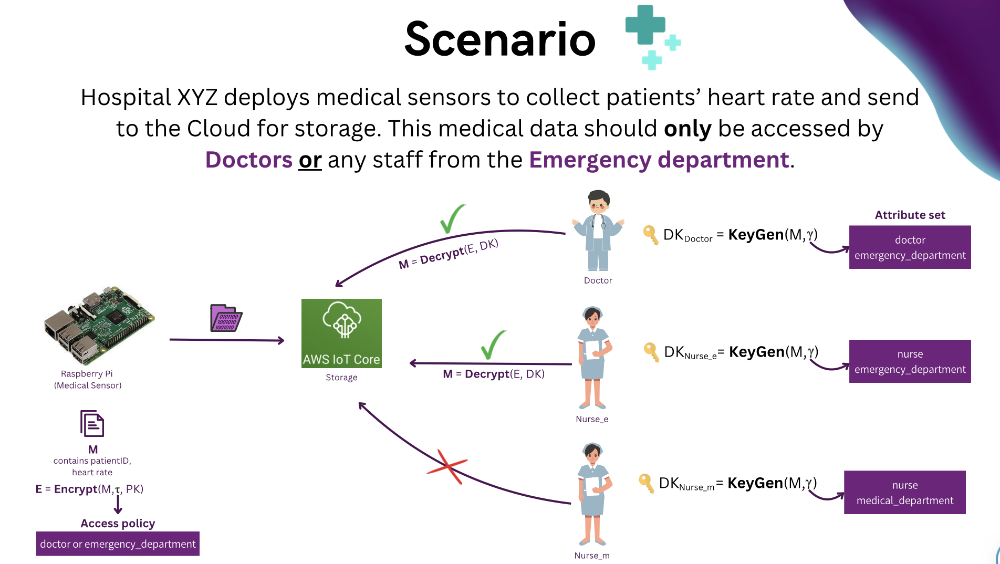

# Pre-requsite
Connect Raspberry Pi to a power source.

# CP-ABE


# Getting Started
1. Launch Kali Linux and execute the following commands.
    <br>
    a. Initial setup to generate a public key and a master secret key.
    ```
    cpabe-setup
    ```
    b. Generate private keys.
    ```
    cpabe-keygen -o doctor_priv_key pub_key master_key \ doctor emergency_department
    ```
    ```
    cpabe-keygen -o nurse_e_priv_key pub_key master_key \ nurse emergency_department
    ```
    ```
    cpabe-keygen -o nurse_m_priv_key pub_key master_key \ nurse medical_department
    ```
    c. Encrypt file
    ```
    cpabe-enc pub_key data 'doctor or emergency_department'
    ```
2. Launch Terminal and execute the following commands.
    ``` 
    ssh xuanli@xuanli.local
    ```
    ```
    cd IoT-Cloud-Security
    ```
    ```
    sudo apt install python3-paho-mqtt
    ```
    Send encrypted file to AWS IoT Core.
    ```
    python producer.py
    ```   
3. Under AWS IoT Core, navigate to <b>Test</b> > <b>MQTT test client</b>. Subscribe to `raspi/data` topic to see the messages.
4. Decrypt file
    ``` 
    python receiver.py
    ```
    ``` 
    cpabe-dec pub_key doctor_priv_key received_data.cpabe

    ```
    ``` 
    nano received_data
    ```

# VNC Viewer
Launch VNC Viewer and connect to `192.168.111.20:5901`.